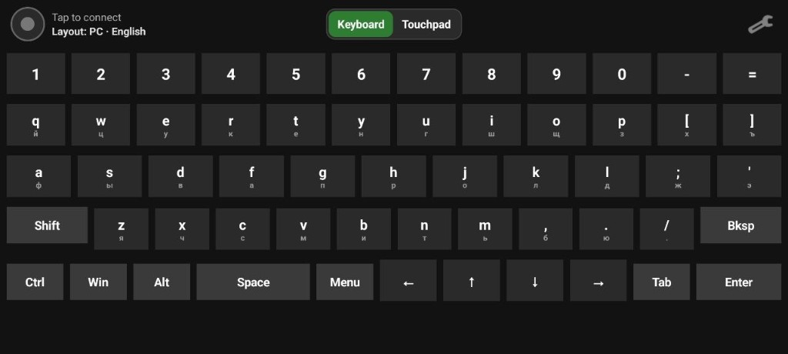
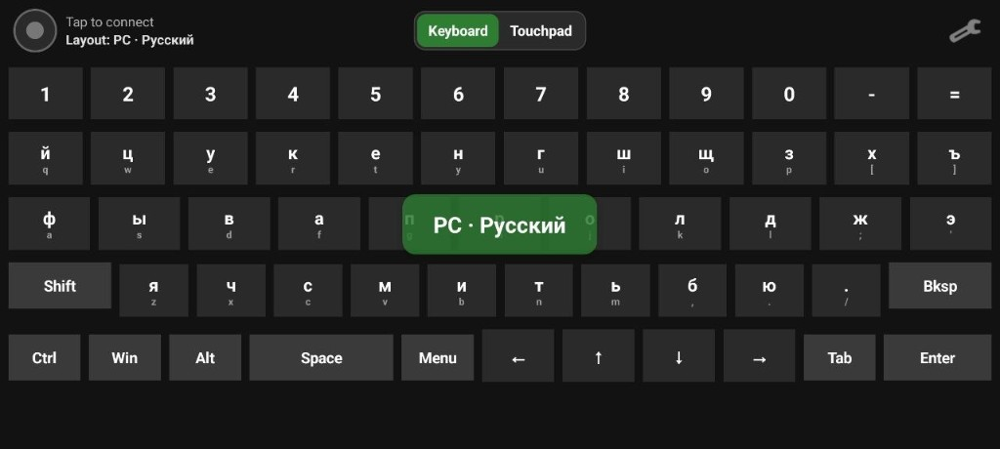
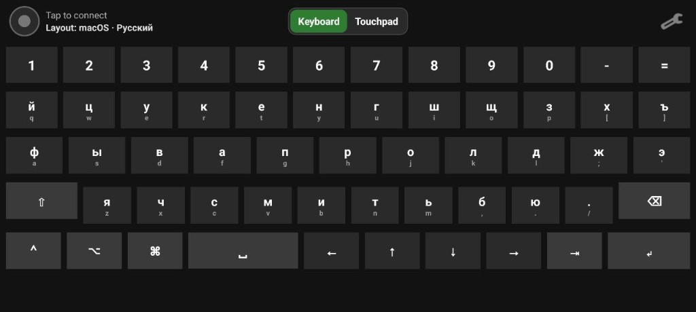
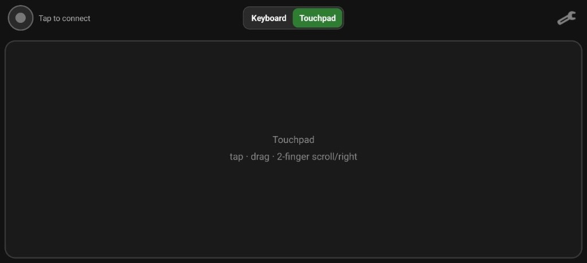
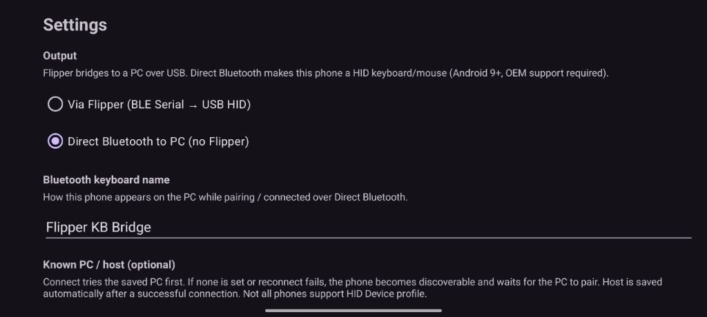
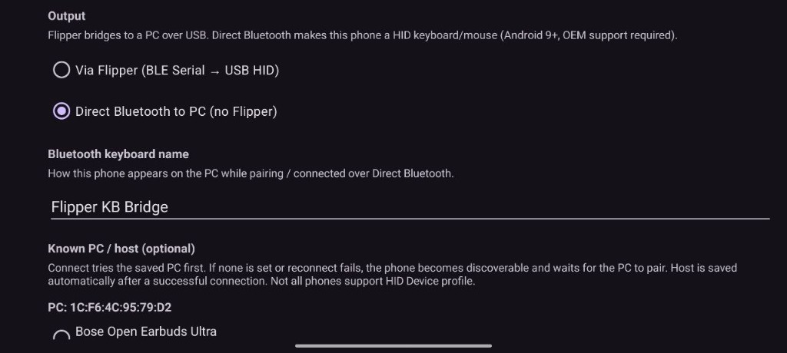
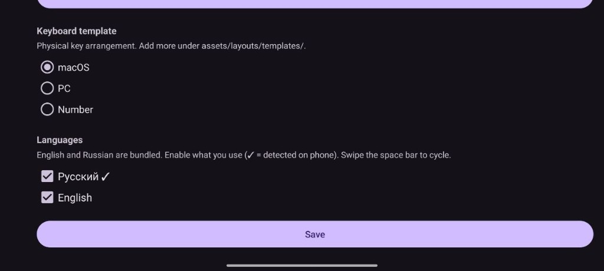
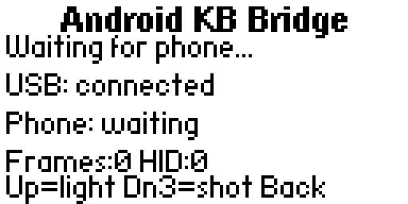
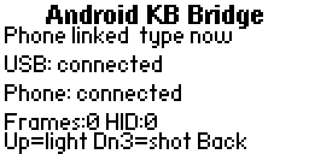

# Android Keyboard → Flipper Zero → USB HID

Bluetooth bridge / direct HID: a landscape Android app can send keyboard and mouse events either through Flipper Zero (BLE Serial → USB HID) or **directly to a PC over Bluetooth HID** (no Flipper).

```
Android app  ──BLE Serial──►  Flipper FAP  ──USB HID──►  PC
```

## Motivation

I often work with devices that ship without a keyboard and needed something universal — a keyboard that can reach hosts over as many interfaces as practical (USB via Flipper today, direct Bluetooth HID from the phone, more later). Dedicated mini keyboards help, but their radio dongles kept going missing, which got old fast. A phone is almost always in reach, and a Flipper Zero is harder to lose than a tiny USB stick — so the phone becomes the keys, and Flipper (or Bluetooth) is the cable into the target.

## Screenshots

### Android app

Keyboard (macOS EN), disconnected:



Layout switch banner after swiping the space bar:



Connected (macOS RU):



Touchpad mode:



Settings — output mode (Flipper vs Direct Bluetooth) and keyboard name:



Settings — Direct Bluetooth host list:



Settings — keyboard template (macOS / PC / Number) and languages:



### Flipper FAP (Android KB Bridge)

Waiting for phone (USB connected). Bottom hint includes `Dn3=shot` when built with `AKB_SCREENSHOT=1`:



Phone connected over BLE — ready to type:



On-device capture: triple short **Down** → PBM on SD (`apps_data/android_keyboard_bridge/`). Details: `docs/FLIPPER.md`.

More screenshots: `docs/screenshots/`.

## Components

| Path | Description |
|------|-------------|
| `docs/BUILD.md` | Build, flash, install, troubleshooting |
| `docs/ANDROID.md` | Android app UI, Settings, templates + language packs |
| `docs/FLIPPER.md` | FAP behavior, USB identity, BLE/RPC, optional screenshots |
| `docs/PROTOCOL.md` | BLE UUIDs and frame format |
| `docs/screenshots/` | Android + Flipper UI screenshots |
| `flipper/android_keyboard_bridge/` | Flipper FAP sources (**C** — production / default) |
| `flipper/android_keyboard_bridge_rust/` | Same FAP in **Rust**, for educational purposes only |
| `android/` | Android app (`assets/layouts/templates/`, `assets/layouts/languages/`) |

## Requirements

- Flipper Zero
- Android 8.0+ (API 26), BLE
- USB data cable (Flipper ↔ PC)
- Phone paired with Flipper in system Bluetooth settings
- Local `flipperzero-firmware` checkout to build the FAP
- JDK 17 for command-line Android builds

## Quick start

```bash
# Flipper
make flipper-link
make flipper-launch

# Android
make apk-install
```

Then on the phone:

1. **Settings** → choose **Via Flipper** or **Direct Bluetooth to PC**, pick a **template** (macOS / PC / Number) and enable **languages** (EN/RU bundled) → Save  
2. Tap the **top-left** connection button (green = ready; blue = waiting for PC to pair in Direct mode)  
3. For Direct BT without a saved PC: accept discoverable, then pair/connect from the PC — host MAC is saved automatically  
4. Type on the keyboard, or use the top-center **Keyboard | Touchpad** switch  
5. Swipe on the **space bar** to switch languages (banner + toolbar show the active name)  

Details: `docs/ANDROID.md`, `docs/FLIPPER.md`.

Bundled templates: **macOS**, **PC**, **Number**. Language packs: **EN**, **RU**. Drop extra language JSON into the app’s `files/layouts/languages/` folder (see Settings hint / `docs/ANDROID.md`).

Layout screens are for convenience only — they do not switch the Mac/PC input language; match the host keyboard source yourself (see `docs/ANDROID.md`).

## Build shortcuts

```bash
make help
make apk
make apk-install
make apk-release          # → FlipperZeroKbd-<version>.apk
make apk-release-install
make flipper-link
make flipper-build
make flipper-flash
make flipper-launch
make flipper-rust-build   # optional educational Rust FAP (.fap)
make flipper-cli
```

Full instructions: `docs/BUILD.md`.

## Protocol

Keyboard taps use `key_down` / `key_up`; touchpad uses mouse move / button / scroll frames (same 6-byte header). See `docs/PROTOCOL.md`.

## Credits

Built with help from [Cursor](https://cursor.com).
